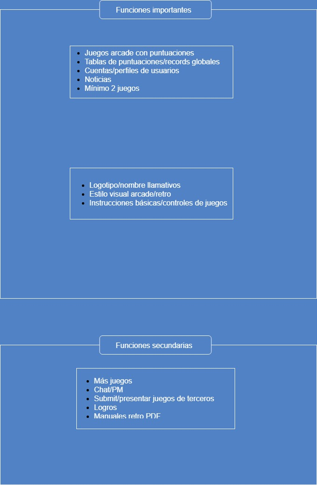
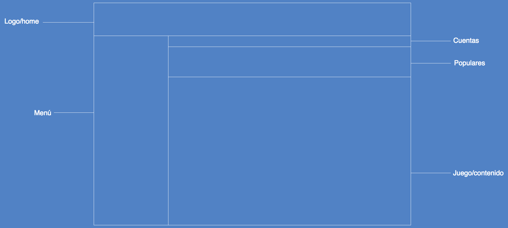
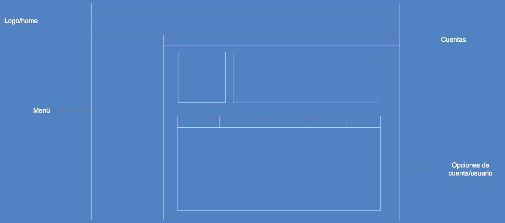
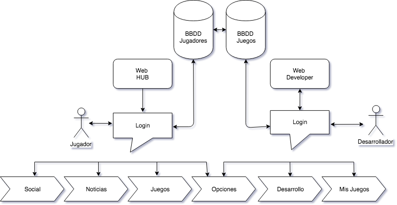

# Arcade Hub

### Resumen
Página de juegos arcade en la que los usuarios pueden jugar a distintos juegos y guardar sus puntuaciones máximas, tanto en sus perfiles como en marcadores de puntuaciones que habrá en la página. En principio se hostearan dos juegos, uno desarrollado por Enzo y el otro por Jefferson, pero siempre cabe la posibilidad de añadir más.

**Plan general del proyecto**

### Posibles layouts/diseños

#### Diseño 1:

 
**Página principal**

Los usuarios podrán hacer clic en el logo de la página para volver al home. A la izquierda tienen un menú con las distintas secciones (juegos, records, noticias, torneos, consejos, etc.). Encima de la lista de juegos hay una sección con una lista de los más populares, y encima de dicha sección están los botones de cuentas. Si el usuario está registrado y logeado, podrá acceder a su perfil. Si no, le aparecerán los botones para registrarse o iniciar sesión.

**Página de cuenta/perfil**

Al entrar a su perfil, el usuario podrá ver información (sus puntuaciones recientes y/o más altas en cada juego y en general, sus amigos, notificaciones, mensajes privados...) y podrá cambiar varios parámetros, como su avatar, su nombre de usuario o su contraseña.

**Flow de funcionalidad/desarrollo**

Si es posible, se añadirá una sección para desarrolladores, en la que podrán subir y probar su juego en estado de alfa si es aprobado, y finalmente publicarlo cuando terminen de desarrollarlo.

